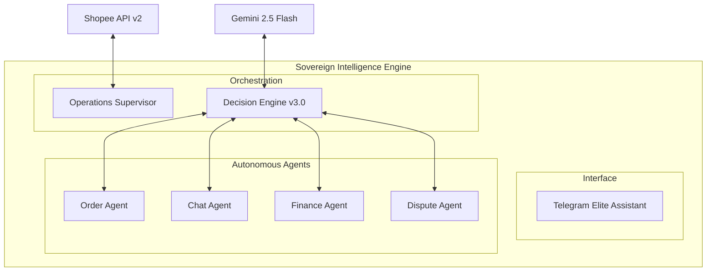

# 🚀 Shopee Intelligence Engine v3.0.0

> **Intelligence Sovereign Edition** — Perpaduan mutakhir antara Autonomous Agents, Multimodal AI, dan Kepatuhan Finansial untuk operasional Shopee skala perusahaan.

[]()
[]()
[]()

---

## 🏛️ Arsitektur Sistem

Sistem ini dibangun di atas fondasi **Agentic Micro-Services** yang modular dan tangguh. Setiap keputusan bisnis divalidasi oleh lapisan kecerdasan multimodal sebelum dieksekusi.




---

## ✨ Fitur Unggulan

### 🧠 Intelligence Layer
- **Multimodal AI**: Analisis otomatis foto sengketa dan rekaman suara untuk perintah operasional.
- **Resilient LLM**: Mekanisme *Auto-Retry* dan *Fallback* antar provider (Gemini ↔ OpenRouter) untuk jaminan stabilitas 99.9%.
- **KB Learning**: Ajarkan bot mengenai produk baru langsung melalui antarmuka Telegram.

### 🛡️ Operational Hardening
- **Zero-Hang Flow**: Typing indicators dan penanganan error global memastikan bot selalu responsif.
- **Financial Audit**: Rekonsiliasi margin otomatis per transaksi dengan output Excel/GSheets.
- **Sovereign Security**: Seluruh kredensial dikelola via environment vault, tanpa data hardcoded.

---

## 📂 Struktur Proyek (Exhaustive Tree)

Berikut adalah struktur folder mendetail yang menunjukkan modularitas sistem:

```text
.
├── 📁 alembic/              # Migrasi skema database (SQLAlchemy)
├── 📁 data/                 # Database SQLite, Logs, & Arsip Laporan
├── 📁 docs/                 # Dokumentasi API & Panduan Pengguna
├── 📁 src/                  # Source Code Utama
│   └── shopee_agent/
│       ├── 🧠 app/          # Core Intelligence (The Agents)
│       │   ├── analytics.py # Analisis KPI & Pertumbuhan
│       │   ├── chat.py      # NLP Brain & Balasan Otomatis
│       │   ├── dispute.py   # Defender sengketa & retur
│       │   ├── finance.py   # Auditor margin & pajak
│       │   ├── order.py     # Monitor lifecycle pesanan
│       │   ├── logistics.py # Cloud printing & Shipping management
│       │   ├── vision.py    # Vision AI Photo Analysis
│       │   └── ... (25+ specialized modules)
│       ├── 🔌 providers/    # Gateways & Integrasi Eksternal
│       │   ├── shopee/      # Shopee API v2 Protocols
│       │   ├── llm/         # Gemini 2.5 & OpenRouter Gateway
│       │   └── notifications/ # Dispatcher Telegram & SMS
│       ├── 🏛️ persistence/   # Data Layer (Resilience)
│       │   ├── models.py    # Definisi Tabel DB
│       │   └── repositories.py # Data Access Logic
│       ├── 🎮 entrypoints/   # Interface Layer
│       │   ├── telegram/    # UI/UX Bot Telegram (Elite Feel)
│       │   ├── api/         # Webhook Receiver (FastAPI)
│       │   └── worker/      # Background Task Orchestrator
│       └── 📄 contracts/     # Pydantic Schemas & Type Definitions
├── 📁 tests/                # Suite pengujian unit & integrasi
├── 📄 .env.example          # Template konfigurasi produksi
├── 📄 Dockerfile            # Blueprint kontainerisasi
├── 📄 Makefile              # Pintasan perintah operasional
├── 📄 setup.sh              # Interactive setup wizard (1-Click)
└── 📄 start.sh              # Main process orchestrator
```

---

## 🚀 Memulai (Quick Start)

### 1-Click Installation
Gunakan wizard instalasi kami untuk mengatur segalanya secara otomatis:
```bash
make setup
```

### Jalankan Layanan
Aktifkan seluruh ekosistem (API, Bot, & Worker):
```bash
make start
```

---

## 🔄 Alur Kerja (Human-In-The-Loop)

Sistem ini tidak menggantikan manusia, melainkan memperkuatnya:
1. **Detect**: Bot memantau setiap event (Chat/Order) secara real-time.
2. **Analyze**: AI Gemini 2.5 Flash melakukan klasifikasi risiko dan sentimen.
3. **Draft**: Draf balasan atau aksi audit disiapkan secara otomatis.
4. **Approve**: Operator menyetujui atau mengedit aksi melalui `/inbox`.

---

## 📱 Panduan Perintah Telegram

| Perintah | Deskripsi |
| :--- | :--- |
| `/start` | Menu utama interaktif. |
| `/inbox` | Pusat kendali tugas & tugas harian. |
| `/dashboard` | Visualisasi performa & KPI bisnis. |
| `/rekap` | Unduh laporan audit finansial bulanan. |
| `/chat` | Analisis pesan pembeli menggunakan AI. |
| `/diagnose` | Cek kesehatan koneksi API & Database. |

---

> Developed with ❤️ by **Antigravity AI** for **Elite Shopee Sellers**.
> *Copyright © 2026 Timcuan. All rights reserved.*
