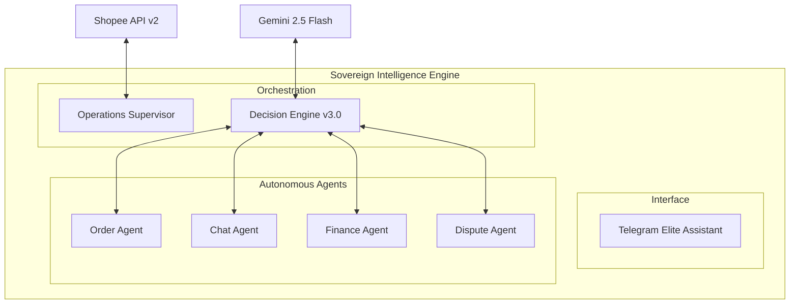

# 🚀 Shopee Intelligence Engine v3.0.0 (Elite Edition)

[]()
[]()
[]()
[]()

**Shopee Intelligence Engine** adalah ekosistem manajemen toko Shopee otonom kelas perusahaan yang menggabungkan Kecerdasan Buatan (Vision & Voice), Kepatuhan Finansial yang ketat, dan pengalaman pengguna Telegram yang ramah (Elite Personal Assistant).

---

## ✨ Fitur Unggulan (Elite Experience)

### 🤖 Kecerdasan Multimodal & Otonom
- **👁️ Vision AI Analysis**: Analisis otomatis foto bukti sengketa dan kondisi stok menggunakan Gemini Vision.
- **🎤 Voice Command Routing**: Kontrol operasional toko menggunakan pesan suara (Voice-to-Command).
- **🧠 Interactive KB Learning**: Fitur "Ajarkan AI" yang memungkinkan operator memperbarui basis pengetahuan produk langsung dari Telegram.
- **🛡️ Autonomous Dispute Defense**: Pertahanan otomatis terhadap klaim pembeli berdasarkan data berat paket, sejarah logistik, dan analisis visual.

### 💼 Operasional & Finansial (Zero-Error)
- **⚖️ Financial Reconciliation**: Audit otomatis sesuai standar Shopee API v2 dengan output Excel 14-kolom yang mendetail.
- **📈 Executive Dashboard**: Visualisasi KPI (Omzet, Pertumbuhan, Rate Komplain) secara real-time dengan UI premium.
- **📦 Logistics Orchestration**: Cetak label pengiriman (PDF) dan atur penjemputan (`/ship`) secara instan.
- **🚀 Product Booster**: Otomasi "Naikkan Produk" untuk 5 produk terlaris setiap 4 jam untuk traffic maksimal.

### 💎 User Experience (Living Assistant)
- **🇮🇩 Full Indonesian Localization**: Seluruh antarmuka menggunakan bahasa Indonesia yang natural dan ramah bagi operator non-teknis.
- **⚡ Zero-Hang Architecture**: Penggunaan *typing indicators* dan penanganan error global memastikan bot selalu responsif dan stabil.
- **📥 Task-Oriented Inbox**: Manajemen tugas berbasis prioritas (🔴 Sangat Mendesak, 📊 Menunggu) untuk memastikan tidak ada pesanan yang terlewat.

---

## 🛠️ Tech Stack & Architecture


Sistem ini dibangun dengan arsitektur **Agentic Micro-Services** yang modular:



- **Core**: Python 3.10+ (Asynchronous using `aiogram` & `asyncio`)
- **Intelligence**: Google Gemini 2.5 Flash (Vision, Voice, and Reasoning).
- **Database**: SQLite (WAL Mode) with SQLAlchemy ORM for institutional resilience.
- **Infrastructure**: Docker & Docker Compose for rapid deployment and isolation.
- **Connectivity**: Shopee API v2 (Global Compliance) with auto-token repair mechanism.


---

## 🚀 Instalasi & Setup Cepat (1-Click)

Kami merancang sistem ini agar dapat dijalankan dalam hitungan menit tanpa konfigurasi teknis yang rumit.

### Prasyarat
- Docker & Docker Compose terinstal di komputer Anda.
- Token Telegram Bot (dari [@BotFather](https://t.me/botfather)).

### Langkah-langkah
1. **Clone & Setup**:
   ```bash
   git clone https://github.com/Timcuan/Shoope-agent-v1.git
   cd Shoope-agent-v1
   make setup
   ```
   *Perintah di atas akan mengecek ketergantungan sistem dan membuat file `.env` secara interaktif.*

2. **Jalankan Sistem**:
   ```bash
   make start
   ```

3. **Cek Status**:
   ```bash
   make logs
   ```

---

## 📱 Panduan Perintah Telegram (User Guide)

Gunakan perintah-perintah berikut untuk mengontrol asisten pintar Anda:

| Kategori | Perintah | Fungsi |
| :--- | :--- | :--- |
| **Utama** | `/start` | Memulai sesi dan menampilkan menu utama interaktif. |
| **Tugas** | `/inbox` | Melihat semua tugas mendesak (Pesanan, Komplain, Stok). |
| **Tugas** | `/agenda` | Ringkasan tugas dengan SLA paling mendesak hari ini. |
| **Analisis** | `/dashboard` | Ringkasan performa toko (Omzet & Pertumbuhan). |
| **Keuangan** | `/rekap` | Susun laporan audit bulanan (Excel/GSheets). |
| **AI** | `/chat` | Analisis pesan pembeli & draf balasan cerdas. |
| **Sistem** | `/diagnose` | Pengecekan kesehatan sistem & konektivitas API. |
| **Sistem** | `/sync` | Sinkronisasi manual data toko di latar belakang. |

---

## 🔄 Alur Kerja Otomasi (Workflow)

Sistem bekerja dengan prinsip **Human-In-The-Loop (HITL)** untuk menjamin keamanan dan akurasi:

1.  **🔍 Deteksi**: Bot memantau pesanan dan chat secara real-time setiap 3 menit.
2.  **🧠 Klasifikasi**: AI Gemini menganalisis tingkat risiko (Rendah, Sedang, Tinggi).
3.  **⚡ Aksi**: 
    -   *Sedang*: Dibuatkan draf balasan ➡️ Masuk ke `/inbox` untuk disetujui operator.
    -   *Tinggi*: Peringatan P0 dikirim ke admin ➡️ Memerlukan intervensi manusia segera.
4.  **🎓 Learning**: Jika AI ragu, gunakan tombol **"Ajarkan AI"** untuk memperbarui basis pengetahuan secara instan.

---

## 📂 Struktur Proyek (Comprehensive Overview)

Sistem ini dirancang dengan modularitas tinggi untuk memudahkan pemeliharaan dan skalabilitas:

```text
.
├── 📁 alembic/            # Migrasi Database (Versioning)
├── 📁 data/               # Persistent Data (SQLite DB, Logs, Archives)
├── 📁 docs/               # Dokumentasi Teknis & Panduan
├── 📁 src/                # Kode Sumber Utama
│   └── shopee_agent/
│       ├── 🧠 app/        # Logika Bisnis & Autonomous Agents
│       │   ├── analytics_agent.py   # Analisis Pertumbuhan & KPI
│       │   ├── chat_agent.py        # Brain untuk Chat & NLP
│       │   ├── finance_agent.py     # Audit & Rekonsiliasi
│       │   ├── order_agent.py       # Manajemen Lifecycle Pesanan
│       │   ├── logistics_agent.py   # Integrasi Pengiriman & PrintNode
│       │   └── ... (20+ Specialized Agents)
│       ├── 🔌 providers/    # Integrasi Pihak Ketiga
│       │   ├── shopee/      # Shopee API v2 (Auth, Client, Gateway)
│       │   ├── llm/         # Resilient LLM (Gemini 2.5 Flash)
│       │   └── notifications/ # Telegram & Multi-channel Alerting
│       ├── 🏛️ persistence/  # Layer Data & Persistence
│       │   ├── models.py    # Skema Tabel Database
│       │   └── repositories.py # Data Access Object (DAO) Pattern
│       ├── 🎮 entrypoints/  # Entry Layer (Interfaces)
│       │   ├── telegram/    # Handler Bot, Keyboards, & UI
│       │   ├── api/         # FastAPI Endpoints (Webhook)
│       │   └── worker/      # Background Tasks (Celery-like)
│       └── 📄 contracts/    # Schema & Tipe Data (Pydantic)
├── 📁 tests/              # Unit & Integration Testing
├── 📄 .env.example        # Template Konfigurasi Lingkungan
├── 📄 Dockerfile          # Definisi Container Image
├── 📄 docker-compose.yml  # Orkestrasi Layanan (API + Bot + Worker)
├── 📄 Makefile            # Pintasan Perintah (setup, start, logs)
├── 📄 pyproject.toml      # Manajemen Dependensi & Versi
├── 📄 setup.sh            # Skrip Instalasi Interaktif (1-Click)
└── 📄 start.sh            # Skrip Eksekusi Entrypoints
```


---

## 📄 Dokumentasi & Changelog
- [CHANGELOG.md](CHANGELOG.md): Sejarah lengkap pembaruan fitur.
- [docs/walkthrough.md](docs/walkthrough.md): Panduan mendalam fitur-fitur agen.
- [docs/api_compliance.md](docs/api_compliance.md): Detail implementasi kepatuhan API Shopee v2.

---
*Developed with ❤️ by Antigravity AI for Elite Shopee Sellers.*
*Copyright © 2026 Timcuan. All rights reserved.*
