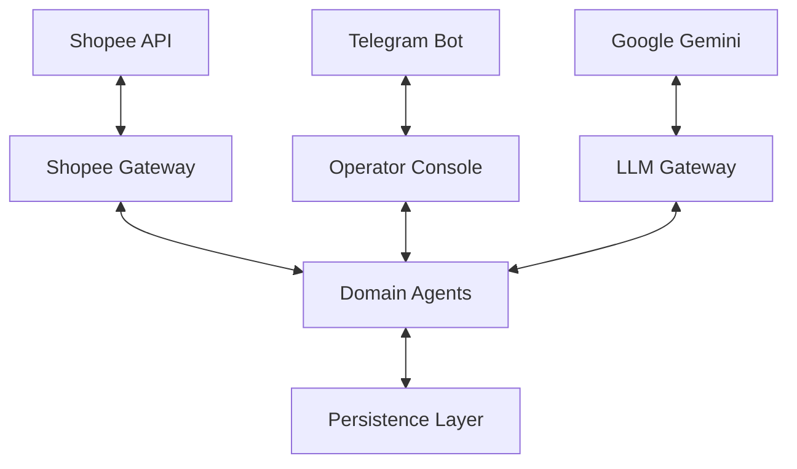

# System Architecture - Shopee Agent

The Shopee Agent is a modular automation system designed to handle large-scale e-commerce operations using a combination of deterministic rules and LLM intelligence.

## 1. High-Level Architecture

## 2. Core Components

### Domain Agents
- **Order Agent**: Manages order lifecycle and SLA monitoring.
- **Logistics Agent**: Handles tracking and shipping documents.
- **Finance Agent**: Reconciles settlements and detects anomalies.
- **Inventory Agent**: Syncs stock levels and identifies stale listings.
- **Chat Agent**: Classifies buyer intent and drafts replies (LLM-assisted).
- **Dispute Agent**: Triages returns/refunds and summarizes evidence.
- **Knowledge Agent**: Manages the local Product Knowledge Base.

### Intelligence Layers
1. **Deterministic Filter**: Keyword-based classification for 100% reliability in common cases.
2. **LLM Refinement (Gemini)**: Refines risk assessment based on buyer mood and generates natural responses.
3. **Policy Engine**: Controls which actions can be automated based on risk tiers (Low/Medium/High).

### Persistence Layer
- **SQLite**: Local system of record for offline capability and speed.
- **SQLAlchemy**: ORM for structured data management.
- **Alembic**: Version control for database schema migrations.

## 3. Data Flow (Event-Driven)
1. **Ingest**: Data is synced from Shopee via polling or webhooks.
2. **Analyze**: Domain agents evaluate the data against local policy and LLM insights.
3. **Decision**: Agents emit a `Decision` (Auto-execute, Draft, or Escalate).
4. **Task**: If human input is needed, an `OperatorTask` is created in the Telegram Inbox.
5. **Action**: Side effects (Shopee API calls) are executed only after approval or high-confidence auto-trigger.

## 4. Multi-Shop Orchestration
- Every record is isolated by `shop_id`.
- Credentials are managed per shop in `shop_tokens`.
- Telegram commands allow switching contexts or viewing global summaries.
