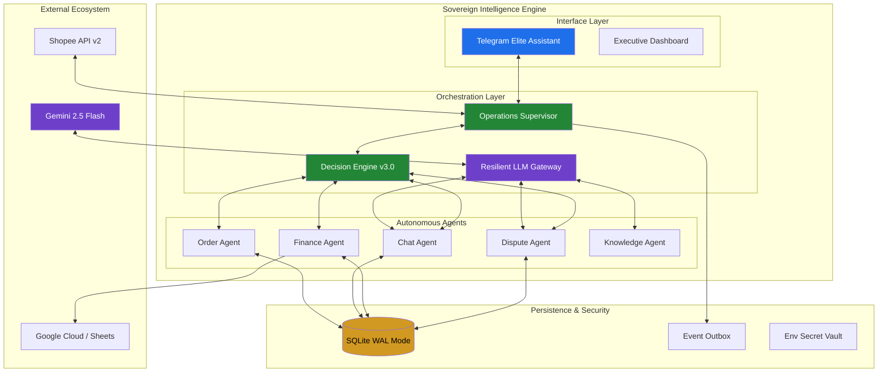

# System Architecture - Shopee Intelligence Engine

Shopee Intelligence Engine adalah sistem otomasi modular yang dirancang untuk menangani operasional e-commerce skala besar menggunakan kombinasi aturan deterministik dan kecerdasan LLM (Large Language Model).

## 1. High-Level Architecture (Elite Agentic Flow)

Sistem menggunakan pola **Event-Driven Agentic Architecture** dengan lapisan orkestrasi yang cerdas:

## 2. Core Components (Agent Layers)

### 🧩 Domain Agents
- **Order Agent**: Mengelola siklus hidup pesanan dan pemantauan SLA.
- **Logistics Agent**: Menangani pelacakan dan dokumen pengiriman (PDF Waybill).
- **Finance Agent**: Rekonsiliasi penyelesaian dana dan deteksi anomali margin.
- **Inventory Agent**: Sinkronisasi stok dan identifikasi produk yang tidak aktif.
- **Chat Agent**: Klasifikasi niat pembeli dan pembuatan draf balasan (LLM-assisted).
- **Dispute Agent**: Triase pengembalian dana dan perangkuman bukti foto (Vision AI).
- **Product Knowledge Agent**: Mengelola Basis Pengetahuan Produk lokal (KB) yang bisa dipelajari.

### 🧠 Intelligence Layers
1. **Deterministic Filter**: Klasifikasi berbasis kata kunci untuk keandalan 100% pada kasus umum.
2. **LLM Reasoning (Gemini)**: Analisis mendalam terhadap mood pembeli, isi foto, dan pembuatan respon natural.
3. **Resilient Wrapper**: Mekanisme retry otomatis dan failover antar provider AI untuk menjamin bot tidak pernah "bisu".

### 💎 Living UX Layer (Telegram)
- **Typing Management**: Sinkronisasi status "mengetik" dengan durasi pemrosesan AI.
- **Global Error Boundary**: Pembungkus try-except pada setiap handler untuk mencegah crash total.
- **Human-In-The-Loop (HITL)**: Antarmuka persetujuan (Inbox) untuk tugas-tugas berisiko tinggi.

## 3. Alur Data (Lifecycle)
1. **Ingest**: Data ditarik dari Shopee setiap 3 menit (Polling/Sync).
2. **Analyze**: Agen mengevaluasi data terhadap kebijakan lokal dan wawasan AI.
3. **Decision**: Agen menghasilkan `Decision` (Otomasi, Draf, atau Eskalasi).
4. **Task**: Jika intervensi manusia dibutuhkan, `OperatorTask` dibuat di Inbox Telegram.
5. **Action**: Panggilan API Shopee hanya dilakukan setelah persetujuan manusia atau tingkat kepercayaan AI >95%.

## 4. Multi-Shop Orchestration
- Setiap data diisolasi secara ketat menggunakan `shop_id`.
- Token akses dikelola secara otomatis (auto-refresh) per toko.
- Mendukung agregasi data global (Dashboard) untuk melihat performa seluruh jaringan toko dalam satu layar.

---
*Arsitektur ini dioptimalkan untuk skalabilitas dan ketahanan produksi (v3.0.0).*
